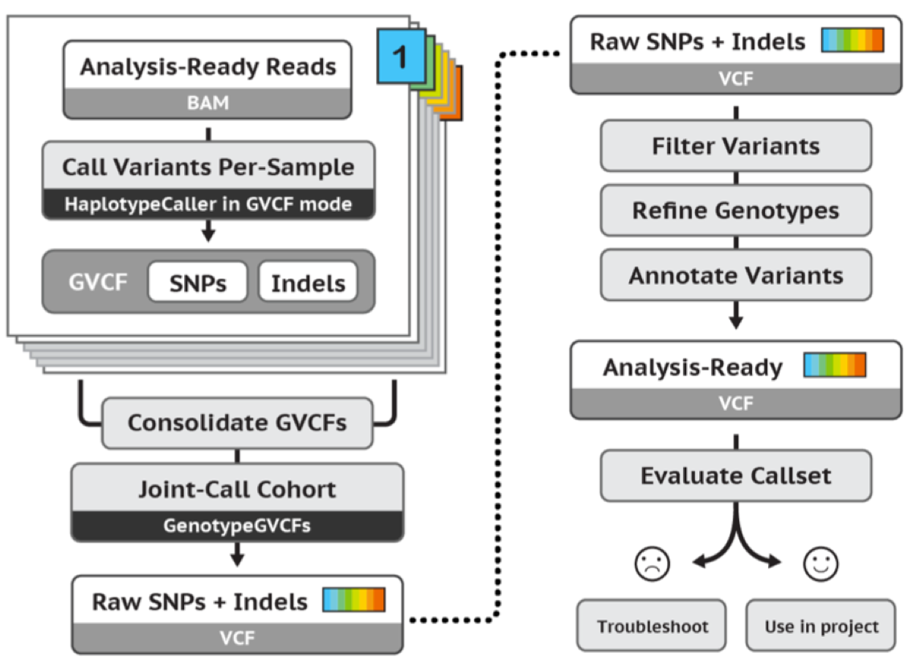
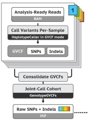
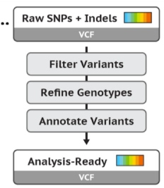

# Bioinformática Instrumental - Módulo II
# Identificação de Variantes Genéticas

## Aula05: Chamada de Variantes e Controle de Qualidade
Seguiremos utilizando as boas práticas de chamada de variantes preconizadas pelo pacote de ferramentas [GATK](https://software.broadinstitute.org/gatk/) (_Genome Analysis Toolkit_).

Nesta etapa utilizaremos os dados "limpos", pré-processados (após ApplyBQSR), para iniciar a chamada de variantes propriamente dita. Identificaremos SNPs e INDELs de linhagens tumorais e germinativas para produzir um único conjunto de dados no formato [VCF](https://samtools.github.io/hts-specs/VCFv4.2.pdf) (_variant call format_). Por fim, filtraremos variantes potencialmente artefatuais com base em escores de qualidade gerados pelo software de chamada de variantes e pelos demais programas até aqui utlizados.
O workflow completo abordado nesta aula prática:   
 

A seguir, executaremos o passo-a-passo da chamada de variantes e refinamento dos dados:

### PASSO 1: ACESSO AO SERVIDOR REMOTO BIOINFO
Para relembrar como fazer a conexão ao servidor remoto via Putty, reveja os passos [aqui](https://github.com/cmasotti/BioinfoInstrumental-Aula05/blob/master/Acesso_servidor_remoto.pdf).

### PASSO 2: ORGANIZAR ESTRUTURA DE DIRETÓRIOS NO SERVIDOR REMOTO
No prompt da linha de comando no servidor remoto, criar diretórios para pré-processamento.
```bash   
aluno30@ea046e981f34:~$ 
aluno30@ea046e981f34:~$ cd /mnt/curso/aluno30/          # diretório de trabalho   
aluno30@ea046e981f34:/mnt/curso/aluno30$ ls             # confira os arquivos e diretórios existentes   
aluno30@ea046e981f34:/mnt/curso/aluno30$ mkdir calling  # criar diretório principal de trabalho da aula5  
aluno30@ea046e981f34:/mnt/curso/aluno30$ cd calling 
aluno30@ea046e981f34:/mnt/curso/aluno30/calling$ mkdir hg38   
aluno30@ea046e981f34:/mnt/curso/aluno30/calling$ mkdir gvcf   
aluno30@ea046e981f34:/mnt/curso/aluno30/calling$ mkdir combineGVCFs   
aluno30@ea046e981f34:/mnt/curso/aluno30/calling$ mkdir genotype   
aluno30@ea046e981f34:/mnt/curso/aluno30/calling$ mkdir hardFilters   
aluno30@ea046e981f34:/mnt/curso/aluno30/calling$ mkdir leftNormalization  
aluno30@ea046e981f34:/mnt/curso/aluno30/calling$ mkdir annotation   
aluno30@ea046e981f34:/mnt/curso/aluno30/calling$ ls     # confira os diretórios criados   
annotation  combineGVCFs  genotype  gvcf  hardFilters  hg38  leftNormalization   
```   
Criar link simbólico para o genoma de referência na pasta hg38/:
```bash   
aluno30@ea046e981f34:/mnt/curso/aluno30/calling$ cd hg38   
aluno30@ea046e981f34:/mnt/curso/aluno30/calling/hg38$ ln -s /mnt/dados/aula4/hg38/* .  
aluno30@ea046e981f34:/mnt/curso/aluno30/calling/hg38$ ls      # confira os arquivos do hg38 salvos
hg38.dict  hg38.fa  hg38.fa.amb  hg38.fa.ann  hg38.fa.bwt  hg38.fa.fai  hg38.fa.pac  hg38.fa.sa  
```  

### PASSO 3: SALVAR E CONFERIR ARQUIVOS DE DADOS PRÉ-PROCESSADOS 
Na aula passada, realizamos o passo-a-passo da organização e da "limpeza" dos dados para hoje poder prosseguir com a chamada de variantes. No último passo do pré-processamento realizamos o Base Quality Score Recalibration (BQSR) em duas etapas: (1) Detectando sistematicamente os erros de aferição de qualidade da base com [BaseRecalibrator](https://software.broadinstitute.org/gatk/documentation/tooldocs/3.8-0/org_broadinstitute_gatk_tools_walkers_bqsr_BaseRecalibrator.php) e (2) aplicando os novos escores aos dados com [ApplyBQSR](https://software.broadinstitute.org/gatk/documentation/tooldocs/4.0.0.0/org_broadinstitute_hellbender_tools_walkers_bqsr_ApplyBQSR.php).   

```bash   
aluno30@ea046e981f34:/mnt/curso/aluno30/calling$ cd gvcf      # salvar dados pré-processados no diretório do próximo passo   
aluno30@ea046e981f34:/mnt/curso/aluno30/calling/gvcf$ ln -s ../../preprocessing/bqsr/TCGA-BH-A1F0-11B_BRCA_bqsr.ba* .  
aluno30@ea046e981f34:/mnt/curso/aluno30/calling/gvcf$ ln -s ../../preprocessing/bqsr/TCGA-BH-A1F0-01A_BRCA_bqsr.ba* .  
aluno30@ea046e981f34:/mnt/curso/aluno30/calling/gvcf$ ls      # conferir os arquivos salvos
TCGA-BH-A1F0-01A_BRCA_bqsr.bai  TCGA-BH-A1F0-01A_BRCA_bqsr.bam  TCGA-BH-A1F0-11B_BRCA_bqsr.bai  TCGA-BH-A1F0-11B_BRCA_bqsr.bam 
``` 
### PASSO 4: IDENTIFICAÇÃO DE VARIANTES GENÉTICAS
   

Neste passo, utilizaremos a ferramenta [HaplotypeCaller](https://software.broadinstitute.org/gatk/documentation/tooldocs/3.8-0/org_broadinstitute_gatk_tools_walkers_haplotypecaller_HaplotypeCaller.php), também desenvolvida pela equipe do GATK/Broad Institute. O HaplotypeCaller chama SNPs e INDELs simultaneamente utilizando a inferência de haplótipos.

A estratégia "joint analysis" proposta pelo GATK é, na prática, a identificação de SNPs e INDELs germinativas em múltiplos indivíduos em conjunto num único arquivo VCF. A genotipagem conjunta aumenta o poder de detecção de variantes pouco frequentes nas populações e a criação de um arquivo intermediário de genotipagem (GVCF) facilita a "escalabilidade" da análise de grandes coortes.

Para tanto, realizaremos a chamada de variantes em três etapas:

#### PASSO 4.1: GENOTIPAGEM INTERMEDIÁRIA COM HAPLOTYPECALLER GVCF 
No modo GVCF, o HaplotypeCaller é executado para cada amostra e gera um arquivo [VCF](https://en.wikipedia.org/wiki/Variant_Call_Format) genômico intermediário, o **gVCF**, que será usado para genotipagem simultânea de várias amostras de modo muito eficiente. Por isso, o algoritmo HaplotypeCaller é chamado no modo GVCF (parâmetro ```-ERC GVCF```, que quer dizer *Mode for emitting reference confidence scores*).  
Descrição do parâmetro -ERC:   
  > The --emitRefConfidence argument is an enumerated type (ReferenceConfidenceMode), which can have one of the following values:   
  > NONE Regular calling without emitting reference confidence calls.   
  > BP_RESOLUTION Reference model emitted site by site.   
  > GVCF Reference model emitted with condensed non-variant blocks, i.e. the GVCF format.   

Nesta etapa também informamos ao programa as regiões genômicas que são alvos de nosso screening genético e, por isso, via parâmetro ```-L  S06588914_Regions-hg38.main.bed```, fornecemos as coordenadas genômicas no arquivo [.bed](https://genome.ucsc.edu/FAQ/FAQformat.html#format1).   
Informações em um arquivo BED:
  > chr1    65509   65625   -       500     +   
  > chr1    65831   65973   -       500     +     
  
Na pasta gvcf/ crie o link simbólico para a região-alvo, que corresponde às regiões genômicas selecionadas para captura do exoma. 
```bash   
aluno30@ea046e981f34:/mnt/curso/aluno30/calling/gvcf$ ln -s /mnt/dados/aula4/references/S06588914_Regions-hg38.main.bed .   
aluno30@ea046e981f34:/mnt/curso/aluno30/calling/gvcf$ ls                                    # confira o arquivo salvo
aluno30@ea046e981f34:/mnt/curso/aluno30/calling/gvcf$ less -S S06588914_Regions-hg38.main.bed    # veja como é um arquivo .bed   
```  

Na linha de comando abaixo, geramos o GVCF para cada amostra:   
**tumor: TCGA-BH-A1F0-01A_BRCA** 
```bash   
aluno30@ea046e981f34:/mnt/curso/aluno30/calling/gvcf$ gatk --java-options "-Xmx4G" HaplotypeCaller -R ../hg38/hg38.fa -I TCGA-BH-A1F0-01A_BRCA_bqsr.bam -O TCGA-BH-A1F0-01A_BRCA.g.vcf.gz -ERC GVCF -L S06588914_Regions-hg38.main.bed 2> tumor_gvcf.log & 
```  
**normal:TCGA-BH-A1F0-11B_BRCA** 
```bash   
aluno30@ea046e981f34:/mnt/curso/aluno30/calling/gvcf$ gatk --java-options "-Xmx4G" HaplotypeCaller -R ../hg38/hg38.fa -I TCGA-BH-A1F0-11B_BRCA_bqsr.bam -O TCGA-BH-A1F0-11B_BRCA.g.vcf.gz -ERC GVCF -L S06588914_Regions-hg38.main.bed 2> normal_gvcf.log &   
```  

#### PASSO 4.2: FUSÃO DOS ARQUIVOS GVCFs   
Nesta segunda etapa, apenas geramos um arquivo único com várias amostras, uma fusão dos GVCFs gerados no PASSO 4.1. 
Nas versões mais recentes do programa GATK, o input para genotipagem propriamente dita com o HaplotypeCaller é de apenas um g.vcf. Para tanto, utilizaremos o programa [CombineGVCFs](https://software.broadinstitute.org/gatk/documentation/tooldocs/3.8-0/org_broadinstitute_gatk_tools_walkers_variantutils_CombineGVCFs.php).   

Na linha de comando abaixo, execute o CombineGVCFs:   
```bash   
aluno30@ea046e981f34:/mnt/curso/aluno30/calling/gvcf$ cd ../combineGVCFs/     
aluno30@ea046e981f34:/mnt/curso/aluno30/calling/combineGVCFs$ ln -s ../gvcf/*g.vcf.gz .         # faça links simbólicos para os GVCFs gerados.  
aluno30@ea046e981f34:/mnt/curso/aluno30/calling/combineGVCFs$ ln -s ../gvcf/*g.vcf.gz.tbi .     # idem para os indexes   
aluno30@ea046e981f34:/mnt/curso/aluno30/calling/combineGVCFs$ ls                                             # confira os arquivos salvos 
aluno30@ea046e981f34:/mnt/curso/aluno30/calling/combineGVCFs$ gatk --java-options "-Xmx4G" CombineGVCFs -R ../hg38/hg38.fa -V TCGA-BH-A1F0-01A_BRCA.g.vcf.gz -V TCGA-BH-A1F0-11B_BRCA.g.vcf.gz -O TCGAs.g.vcf.gz 2> combine.log &   
```  

#### PASSO 4.3: CHAMADA DE VARIANTES CONJUNTA (JOINT ANALYSIS)   
Nesta terceira etapa, faremos a chamada de variantes conjunta das duas amostras pré-genotipadas pelo HaplotypeCaller, fusionadas num único GVCF compactado (TCGAs.g.vcf.gz).
Para tanto, utilizaremos o programa [GenotypeGVCFs](https://software.broadinstitute.org/gatk/documentation/tooldocs/3.8-0/org_broadinstitute_gatk_tools_walkers_variantutils_GenotypeGVCFs.php).  
Essa ferramenta agrega as várias amostras e mescla os escores e probabilidade dos genótipos de uma maneira sofisticada.  
As variantes identificadas são então re-anotadas com base nos novos escores e também no dataset de polimorfismos humanos conhecidos, o dbSNP (por isso também informamos no parâmetro ```-D dbsnp_146.hg38.vcf```.  

Execute a linha de comando abaixo:   
```bash   
aluno30@ea046e981f34:/mnt/curso/aluno30/calling/combineGVCFs$ cd ../genotype/   
aluno30@ea046e981f34:/mnt/curso/aluno30/calling/genotype$ ln -s ../combineGVCFs/TCGAs.g.vcf.gz* .
aluno30@ea046e981f34:/mnt/curso/aluno30/calling/genotype$ ln -s /mnt/dados/aula4/references/S06588914_Regions-hg38.main.bed . 
aluno30@ea046e981f34:/mnt/curso/aluno30/calling/genotype$ ln -s /mnt/dados/aula4/references/dbsnp_146.hg38.vcf* .
aluno30@ea046e981f34:/mnt/curso/aluno30/calling/genotype$ ls       # confira os arquivos salvos
TCGAs.g.vcf.gz  TCGAs.g.vcf.gz.tbi S06588914_Regions-hg38.main.bed  dbsnp_146.hg38.vcf dbsnp_146.hg38.vcf.idx
aluno30@ea046e981f34:/mnt/curso/aluno30/calling/genotype$ gatk GenotypeGVCFs -R ../hg38/hg38.fa -V TCGAs.g.vcf.gz -L S06588914_Regions-hg38.main.bed -D dbsnp_146.hg38.vcf -O TCGAs.vcf 2> genotypes_GVCFs.log &   
```  

Ao concluir o PASSO 4.3, teremos o resultado final da chamada de variantes num arquivo [VCF](https://en.wikipedia.org/wiki/Variant_Call_Format), *Raw SNPs and INDELs*.  
Explore o arquivo final com os comandos ```less -S, head, tail```.   

### PASSO 5: HARD FILTERS - APLICAR FILTROS DE QUALIDADE ÀS VARIANTES IDENTIFICADAS   
   

Neste passo, avaliaremos as variantes identificadas quanto aos escores de qualidade anotados pelo HaplotypeCaller.  

O GATK tem ferramentas altamente sofisticadas para detecção de variantes artefatuais, como o [VQSR, Variant Quality Score Recalibration](), mas essa ferramenta exige que um número mínimo de amostras sejam avaliadas (n>30).  

Quando analisamos casuísticas pequenas em dados de captura (exomas e painéis de genes), as boas práticas sugerem a aplicação "manual" de critérios de seleção de variantes, como os [HARD FILTERS](https://software.broadinstitute.org/gatk/documentation/article?id=11069). Aplicar os "hard filters" consiste em escolher limiares específicos para uma ou mais anotações (escores de qualidade) e eliminar quaisquer variantes que tenham escores acima ou abaixo desses limites definidos. Esses escores de qualidade são baseados em propriedades ou estatísticas que descrevem cada variante, como, por exemplo, o contexto da sequência genômica da variante, a cobertura total do locus, o número de reads que reportam o alelo variante, a proporção de reads nas orientações forward ou reverse (negative or positive strand), etc.   

Filtros analisados:  
> **FisherStrand (FS):** This is the Phred-scaled probability that there is strand bias at the site. Strand Bias tells us whether the alternate allele was seen more or less often on the forward or reverse strand than the reference allele. When there little to no strand bias at the site, the FS value will be close to 0.   
> **StrandOddsRatio (SOR):** This is another way to estimate strand bias using a test similar to the symmetric odds ratio test.  
> **RMSMappingQuality (MQ):** Instead of the average mapping quality of the site, this annotation gives the square root of the average of the squares of the mapping qualities at the site. It is meant to include the standard deviation of the mapping qualities.  
> **MappingQualityRankSumTest (MQRankSum):** It compares the mapping qualities of the reads supporting the reference allele and the alternate allele.  
> **ReadPosRankSumTest (ReadPosRankSum):**  It compares whether the positions of the reference and alternate alleles are different within the reads.   

Os limiares dos escores avaliados foram indicados pelas boas práticas GATK.  
A seguir, faremos o controle de qualidade de variantes para SNPs e INDELs separadamente.   
Primeiramente, utilizamos o programa GATK [SelectVariants](https://software.broadinstitute.org/gatk/documentation/tooldocs/current/org_broadinstitute_hellbender_tools_walkers_variantutils_SelectVariants.php) para selecionar SNPs ou INDELs. Em seguida, utilizamos o programa [VariantFiltration](https://software.broadinstitute.org/gatk/documentation/tooldocs/current/org_broadinstitute_hellbender_tools_walkers_filters_VariantFiltration.php) para aplicar os *hard filters*.  

Primeiramente, selecione SNPs e INDELs a partir do vcf bruto TCGAs.vcf:  
```bash   
aluno30@ea046e981f34:/mnt/curso/aluno30/calling/genotype$ cd ../hardFilters/
aluno30@ea046e981f34:/mnt/curso/aluno30/calling/hardFilters$ ln -s ../genotype/TCGAs.vcf* .
aluno30@ea046e981f34:/mnt/curso/aluno30/calling/hardFilters$ ls # confira os arquivos salvos  
TCGAs.vcf  TCGAs.vcf.idx
aluno30@ea046e981f34:/mnt/curso/aluno30/calling/hardFilters$ gatk --java-options "-Xmx2G" SelectVariants -R ../hg38/hg38.fa -V TCGAs.vcf --select-type-to-include SNP -O TCGA_SNP.vcf 2> selSNP.log 
aluno30@ea046e981f34:/mnt/curso/aluno30/calling/hardFilters$ gatk --java-options "-Xmx2G" SelectVariants -R ../hg38/hg38.fa -V TCGAs.vcf --select-type-to-include INDEL -O TCGA_INDEL.vcf 2> selINDEL.log
```  

Confira os arquivos que foram gerados usando ```ls ```:  
**TCGA_INDEL.vcf  TCGA_INDEL.vcf.idx  TCGA_SNP.vcf  TCGA_SNP.vcf.idx  selINDEL.log  selSNP.log**  

Em seguida, tendo concluída a seleção, filtre SNPs e INDELs de acordo com os *hard filters*:

**Select SNPs with:**
FS < 60.0  
SOR < 3.0   
MQ > 40.0   
MQRankSum > -12.5  
ReadPosRankSum > -8.0    
```bash   
aluno30@ea046e981f34:/mnt/curso/aluno30/calling/hardFilters$ gatk --java-options "-Xmx2G" VariantFiltration -R ../hg38/hg38.fa -V TCGA_SNP.vcf --filter-expression "FS > 60.0 || MQ < 40.0 || SOR > 3.0 || MQRankSum < -12.5 || ReadPosRankSum < -8.0" --filter-name "HardFilter_SNP" -O TCGA_HF_SNP.vcf 2> filterSNP.log &
```

**Select INDELs with:**   
FisherStrand (FS) 200.0  
ReadPosRankSumTest (ReadPosRankSum) 20.0  
StrandOddsRatio (SOR) 10.0  
```bash   
aluno30@ea046e981f34:/mnt/curso/aluno30/calling/hardFilters$ gatk --java-options "-Xmx2G" VariantFiltration -R ../hg38/hg38.fa -V TCGA_INDEL.vcf --filter-expression "FS > 200.0 || SOR > 10.0 || ReadPosRankSum < -20.0 || InbreedingCoeff < -0.8" --filter-name "HardFilter_INDEL" -O TCGA_HF_INDEL.vcf 2> filterINDEL.log & 
```  

> Explore os arquivos VCFs finais com comandos como **less -S, head, tail**.  


    
    


